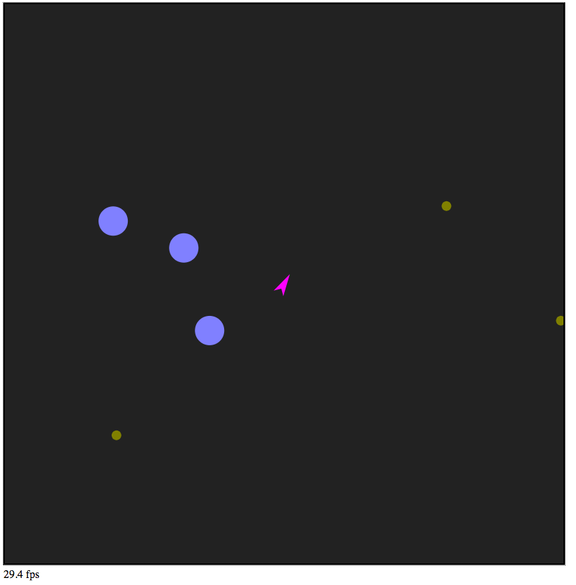

# asteroids_js
Asteroids game in vanilla javascript using Entity+Component pattern, and HTML5 canvas.

Mainly an excuse to practice the Javascript coding style/patterns as described in Douglas Crockford's [JavaScript: The Good Parts](https://www.amazon.com/exec/obidos/ASIN/0596517742/wrrrldwideweb)

## Gameplay

1. Open index.html in your browser
2. Click on the game area to pass focus to the game so keyboard commands are captured.

Control | Action
--|------
W | Prograde thruster
A | Positive rotation
S | Retrograde thruster
D | Negative rotation
Spacebar | Photon Torpedo

